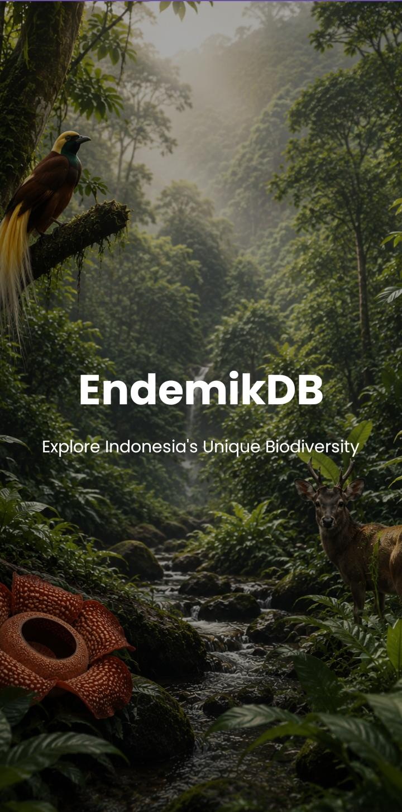
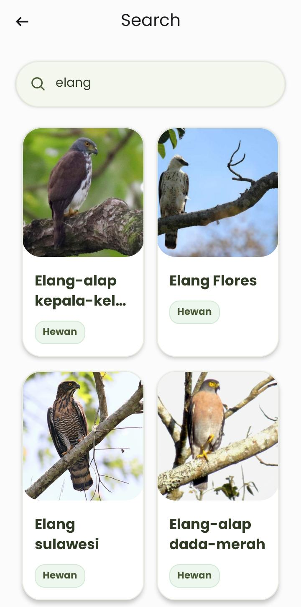
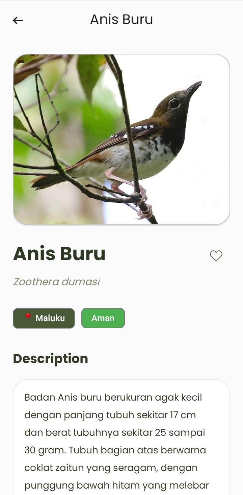
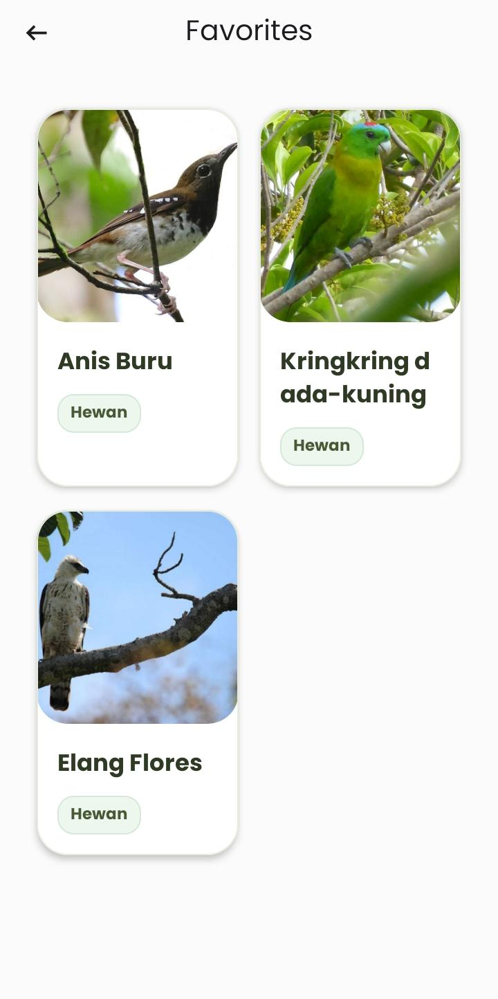
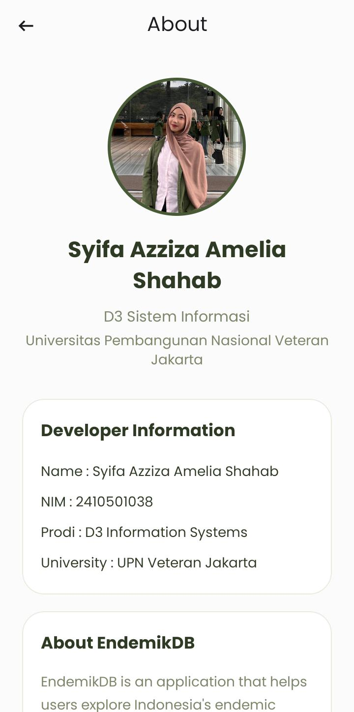

# EndemikDB

EndemikDB is an Android application that provides information about Indonesia's endemic flora and fauna. The application allows users to explore species, search by keyword, filter by region, save favorites, and view detailed information with a modern interface supporting both Light and Dark Mode.

---

# Developer


| Information | Details |
|-------------|---------|
| **Name** | Syifa Azziza Amelia Shahab |
| **Student ID** | 2410501038 |
| **Study Program** | D3 Information Systems |
| **University** | Universitas Pembangunan Nasional Veteran Jakarta |

---

# Features

- Explore endemic flora and fauna in Indonesia
- Real-time search
- Filter by region
- Favorite system using Room Database
- Detailed information for each species
- Light & Dark Mode
- Responsive Material Design UI
- Smooth page transitions and animations

---

# Tech Stack

- Java
- Android Studio
- Material Design 3
- Retrofit
- Gson Converter
- Room Database
- Glide
- RecyclerView
- ViewPager2

---

# 📸 Application Screenshots

## Splash Screen



## Home


## Search



## Detail



## Favorites



## About



---

# API

Data source:

https://hendroprwk08.github.io/data_endemik/endemik.json

---

# Database

This application uses **Room Database** with two tables:

- `endemik`
- `favorit`

---

# Theme

- Light Mode
- Dark Mode

---

# Project Structure

```
activities/
adapters/
api/
database/
entities/
fragments/
repository/
utils/
```

---

# Application Version

**EndemikDB v1.0**

---

© 2026 Syifa Azziza Amelia Shahab
